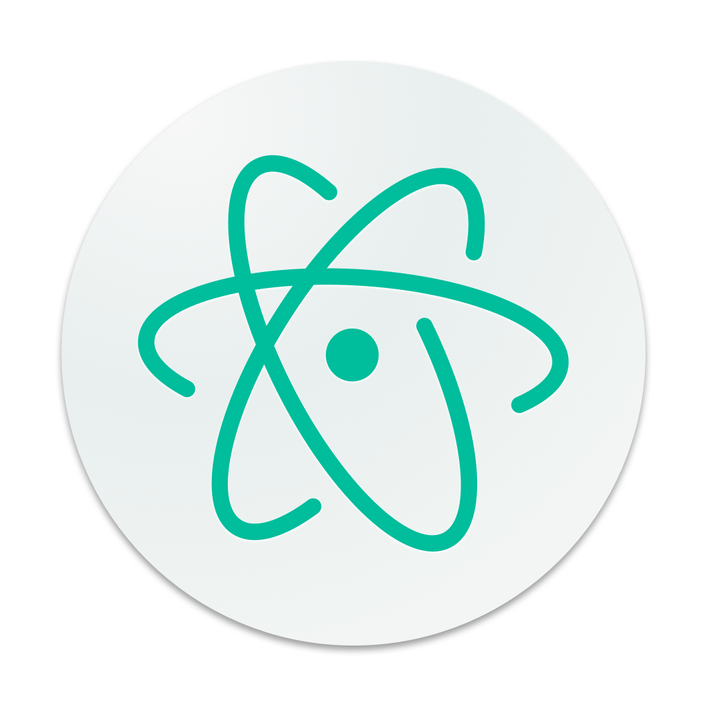

## **Ambiente de desenvolvimento integrado**

[:arrow_upper_left:](../../readme.md)  

 Escolher a IDE de desenvolvimento envolve definir quais tecnologias incorporar no projeto, escolhi utilizar nesses tutoriais o **Visual Studio Code**, mas poderia estudar e escolher a IDE que atenda a necessidade conforme o suporte a tecnologia, segue alguns exemplos de IDE`s: 

| | | | |
|--|--|--|--|
|  |[code](https://code.visualstudio.com/)||[AWS Cloud9](https://aws.amazon.com/pt/cloud9/)|
|  |[IntelliJ IDEA](https://www.jetbrains.com/idea/)| |[WebStorm](https://www.jetbrains.com/webstorm/)|
|  |[Koding](https://www.koding.com/)| |[Eclipse](https://eclipse.org/ide/)|
|  |[Atom](https://atom.io/)| | [Komodo IDE](https://www.activestate.com/komodo-ide) |