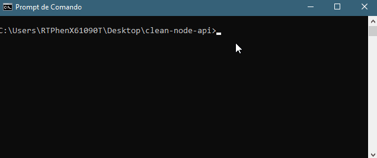

## *.gitignore*

<sub>[:arrow_upper_left:](readme.md)<sub>

ao trabalhar com git, nem todos os arquivos precisam ser controlados por versão, como por exemplo módulos de código compartilhado, podemos mapear esses arquivos através de um .gitignore

---

1. Exemplos

    Vamos incluir no nosso módulo um arquivo chamado .gitignore  
    e edita-lo com o(s) nome(s) dos arquivos a serem desconsiderados.
    >A exemplo o diretório **"node_modules"**

    #### Exemplo 1: Terminal do Windows
    >Através do therminal, na pasta corrente do projeto, podemos executar o comando
    >```
    >cd /d "Desktop/clean-node-api"
    >code .gitignore
    >```
    >que ira incluir o arquivo no projeto e o deixando pronto para edição no visual studio code ou vim, vamos incluir uma linha com o valor "**node_modules"** e salvar o arquivo.
    > 
    >
    #### Exemplo 2: VS Code
    > Criar no diretório do projeto o arquivo .gitignore incluir em uma linha o valor "**node_modules**" e salvar o arquivo.